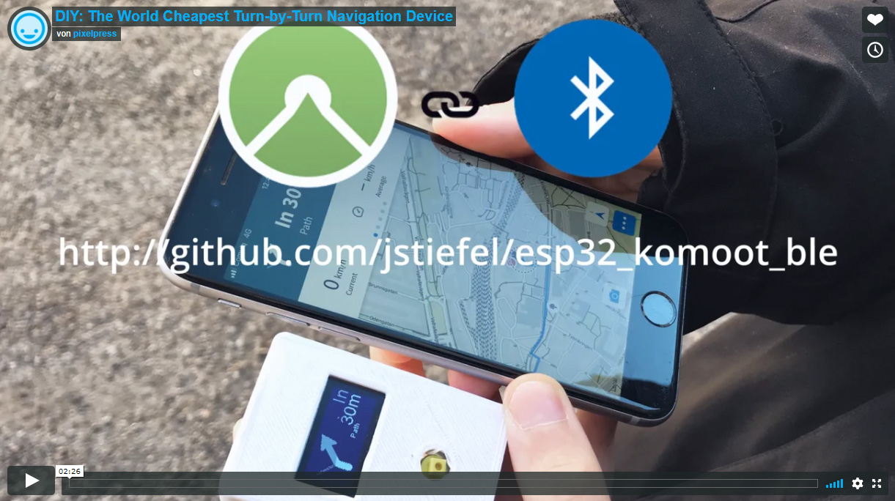
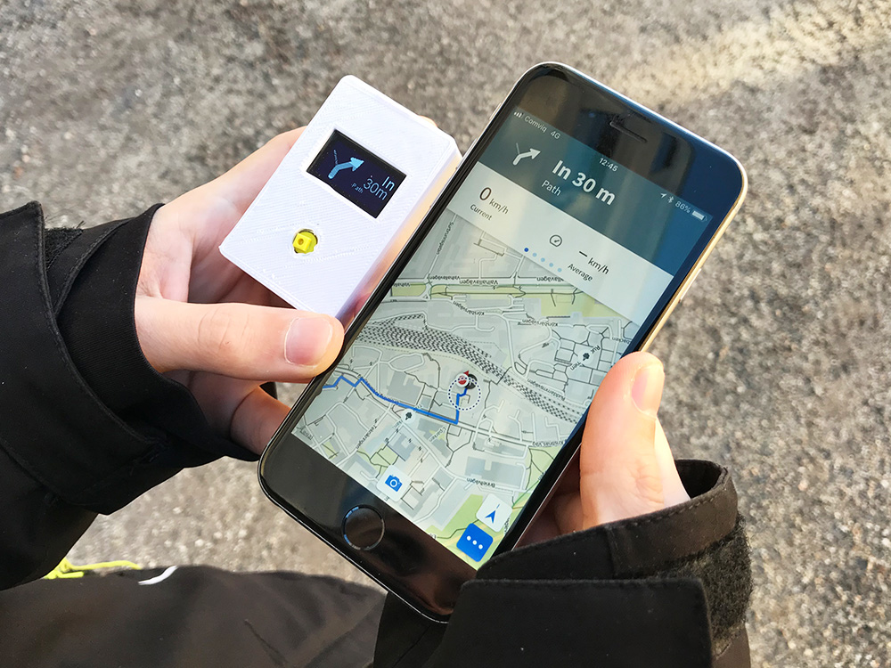
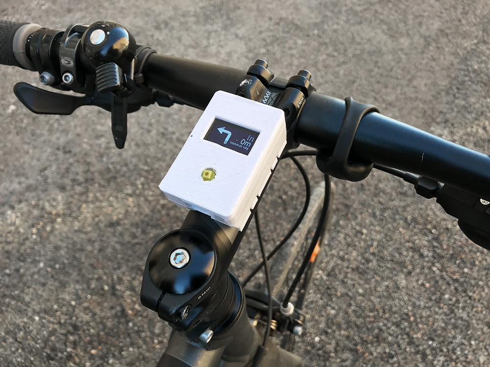
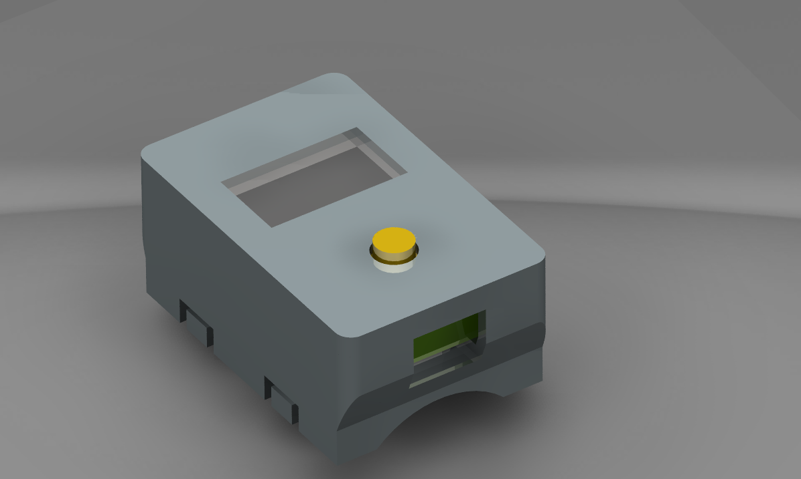
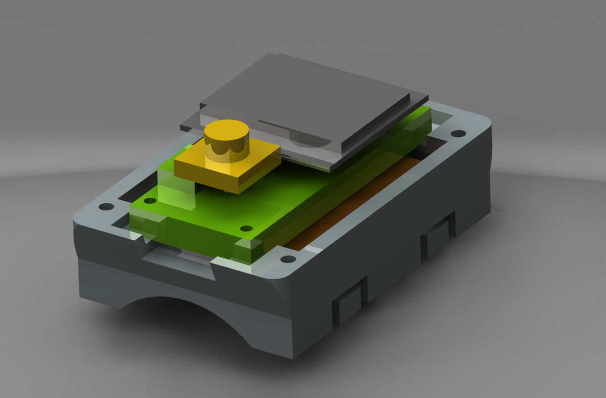
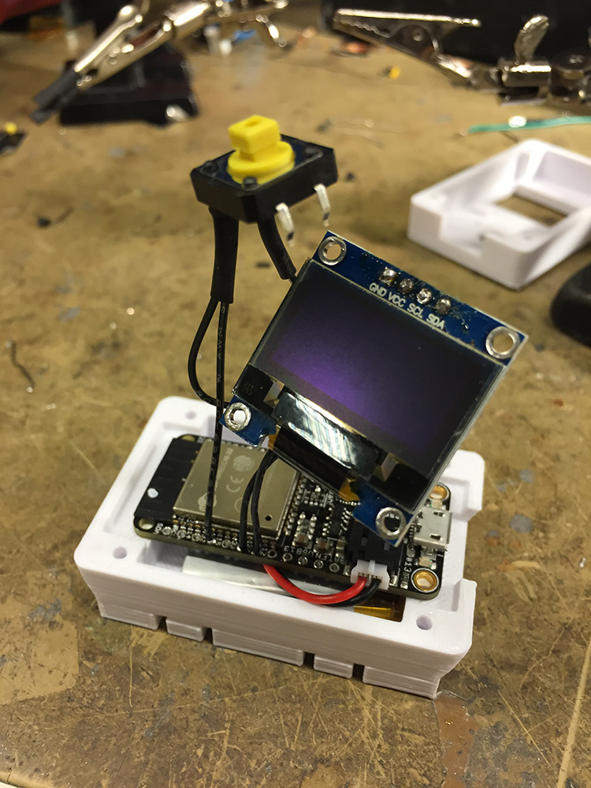
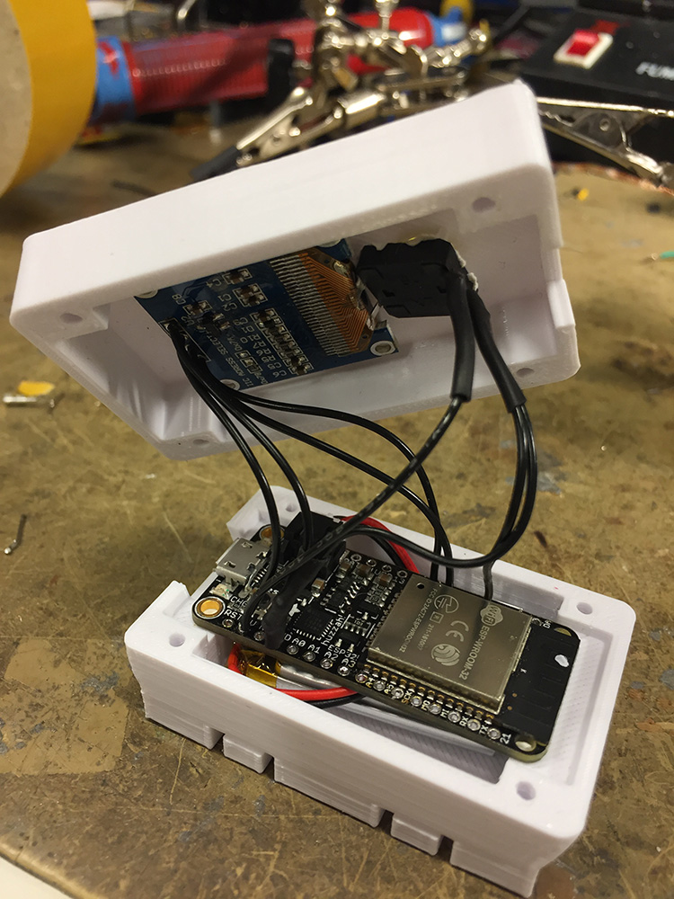

# The Komoot BLE Navigation Device Project

The goal of this project is to create an inexpensive turn-by-turn navigation device based on ESP32 and [Komoot's BLE Connect API](https://github.com/komoot/BLEConnect).

## Overview

This repository includes all the necessary files to build your own turn-by-turn navigation device including the files for the 3D printable case.

## User instructions
1. The battery can easily be charged by connecting the ESP32 to an USB charger if a controller with battery management is used (e.g. Adafruit Huzzah ESP32).
2. To wake up the device from deep sleep press the button. The welcome screen is shown and ESP32 starts searching for the Komoot BLE service.
3. Open the [Komoot app](https://www.komoot.de/) on your phone and make sure Bluetooth on your phone is turned on. Start your navigation. There is no need to manually connect the ESP32 in the settings. After some seconds, the devices are paired.
4. The device now shows the navigation instructions from the Komoot app. 
5. If connection is lost or navigation stopped, ESP32 tries to keep connection to the device for first 100 seconds. After this, it starts searching for new devices. If no new device is found for the next 100 seconds, it returns to deep sleep.
6. Device can manually be turned off by pushing the button. This takes approximately 2 seconds.

## Status

This is a first prototype which is fully working and tested. New functionality and hardware may be added. The ESP32 is quite new and the Arduino implementation still undergoing many changes. It is recommended to use the same release as stated here because there were many issues with BLE when updating versions.

Next steps:

- improve case/ make smaller
- use larger display
- smoothen images
- add more functionality
- add battery indication
- continuously update used libraries

## Hints

- Device can not be completely turned off without disconnecting battery, but we can enter deep sleep by pushing button and waking up again by pushing same button
- Device can be loaded over USB port (LiPo control on-board)
- Rename main file in .ino to work with Arduino IDE

## Hardware

- Adafruit Huzzah ESP32 (or any other with included battery management)
- 128x64 OLED, SSD1306 Controller
- Push button, some wires and 3D printed case, screws
- 3.7V 400mAh LiPo

## Connections

Display:

| Display | ESP32 |
|---|---|
|SDA|Pin 27|
|SCL|Pin 33|
|VCC|VCC|
|GND|GND|

Button:

| Button | ESP32 |
|---|---|
|In|Pin 32 pulled down with 10kOhm resistor connected to GND|
|Out|VCC|

## Dependencies

- [ESP8266 and ESP32 Oled Driver for SSD1306 display 4.0.0 by Daniel Eichhorn, Fabrice Weinberg](https://github.com/ThingPulse/esp8266-oled-ssd1306)
- [Arduino core for ESP32 WiFi chip v1.0.1-rc1](https://github.com/espressif/arduino-esp32) (development release)
- Replace BLE source code in /opt/eclipse/arduinoPlugin/packages/esp32/hardware/esp32/1.0.1-rc1/libraries/BLE/src by commit _11a0aa6_ of [ESP32_BLE_Arduino](https://github.com/nkolban/ESP32_BLE_Arduino)
- Developped in Eclipse with [Sloeber](https://github.com/Sloeber/arduino-eclipse-plugin)

## Assembly

   

   

  

## Credits
- @danielgard for clarifying some things about the Komoot API
- @chegewara for continuously debugging Arduino ESP32 BLE
- Axel Poidevin for carrying the bike and phone in the video

